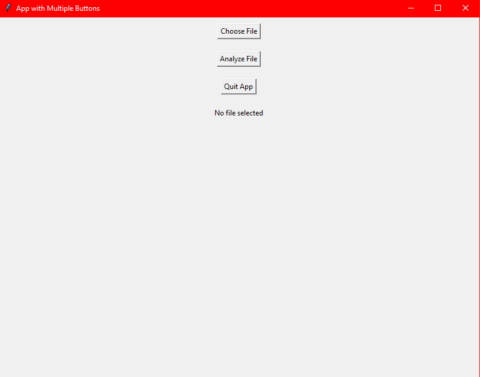
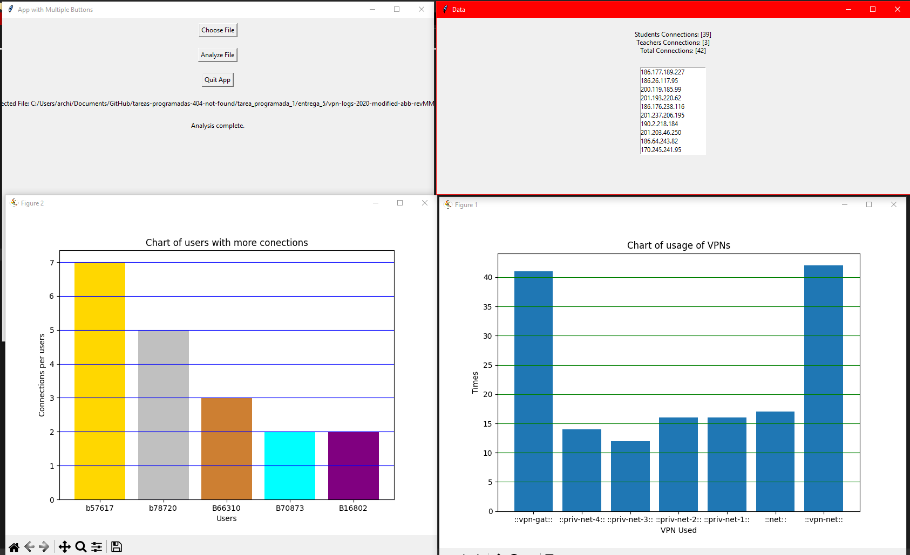

# Aplicación en Python
## Librería PLY usada para el analizador léxico
Para trabajar con expresiones regualres (regex), se hizo uso de la libreria [ply](https://pypi.org/project/ply/), una implementación de lex y yacc escrita en Python.
Para poder trabajar con esa herramienta se debe primero de instalarla con el siguiente comando:
```
pip install ply
```
Es importante notar que se debe de tener instalado un interprete de [**Python 3**](https://www.python.org/) y el gestor de paquetes [**pip**](https://pypi.org/project/pip/).

## Librerias graficas usadas para la interfaz grafica
Para poder trabajar con la interfaz grafica, se hizo uso de las librerias [tkinter](https://docs.python.org/3/library/tkinter.html) y [matplotlib](https://matplotlib.org/).

Para instalar las librerias se debe de ejecutar los siguientes comandos:
```
pip install tkinter
pip install matplotlib
```

## Cómo ejecutar la aplicación
Para ejecutar la aplicación, se debe de ejecutar el siguiente comando:
```
python .\application.py
```

## Cómo funciona el analizador léxico
### Expresiones regulares
Para poder resolver el problema planteado, tuvimos que desarrollar un total de 39 expresiones regulares (regex), los cuales esta representados en el codigo en dos partes:
- un identificador de token presente en la lista de tokens, tiene que ser unica para cada regex
- la expresion regular que se va a usar para reconocer el token, tambien se puede referirse como "regla" que debe de complir una hilera para ser reconocida como un token

## Como funciona la gramatica
### Gramatica
La gramatica usada en la aplicacion es la misma ya presentada en la previa entrega, la cual se puede ver en el siguiente [enlace](https://github.com/UCR-ECCI-MM/tareas-programadas-404-not-found/tree/main/tarea_programada_1/entrega_4).

## Uso de la interfaz grafica
### Pantalla principal
Al iniciar la aplicacion, se muestra la siguiente pantalla:

Esa pantalla tiene 3 botones:
- **choose file**: al presionar ese boton, se abre una ventana para seleccionar el archivo que se desea analizar
- **analyze file**: al presionar ese boton, se analiza el archivo seleccionado y se muestra el resultado en la pantalla de resultados
- **quit app**: al presionar ese boton, se cierra la aplicacion

### Pantalla de resultados
Al presionar el boton **analyze file**, se muestra la siguiente pantalla:

En esa pantalla se muestra lsograficos realizados con la libreria matplotlib, los cuales son:
- **cantidad de conexiones por rutas**: muestra la cantidad de conexiones que se realizaron por cada ruta
- **cantidad de conexiones de los 5 usuarios mas activos**: muestra la cantidad de conexiones que realizo cada uno de los 5 usuarios mas activos
- **lista de ips desde las cuales se conectaron los usuarios**: muestra la lista de ips desde las cuales se conectaron los usuarios
- **cantidad total de conexiones** muestra la cantidad total de conexiones que se realizaron
- **cantidad de conexiones realizadas por profesrores y estudiantes**: muestra la cantidad de conexiones que realizaron los profesores y los estudiantes

## Creditos
### Codigo escrito por:
- [Madriz Agüero Jorge Alejandro](https://github.com/ale-mz)
- [Padilla Fallas Axel Fabián](https://github.com/FabianPadFal)
- [Carrion Claeys Archibald Emmanuel](https://github.com/archibald-carrion)
### Bibliografía usada
- [Documentación de PLY](https://mv1.mediacionvirtual.ucr.ac.cr/pluginfile.php/2053628/mod_resource/content/1/ply-readthedocs-io-en-latest.pdf)
- [Pagina Github oficial de PLY](https://github.com/dabeaz/ply)

